<!-- 스페이스 헤더 (레포에 함께 올린 header.svg) -->

<!-- 타이핑 애니메이션 -->

## 🚀 About Me

- 🔭 **Working on:** Student @ Inha Technical College
- 🌱 **Learning:** AI — especially **Data & Computer Vision**, with `PyTorch` · `FastAPI` · `Docker`
- ⚙️ **Values:** Architecture design · Idea development · Ops & Deployment

## 🛠 Tech Stack

### Languages

### Frameworks & Libraries

### Database & Tools

## 🧩 Problem Solving

## 🐍 Contribution Snake

<picture>
  <source media="(prefers-color-scheme: dark)" srcset="https://raw.githubusercontent.com/ZAE0N/ZAE0N/output/github-contribution-grid-snake-dark.svg"/>
  <source media="(prefers-color-scheme: light)" srcset="https://raw.githubusercontent.com/ZAE0N/ZAE0N/output/github-contribution-grid-snake.svg"/>
  
</picture>

## 📈 GitHub Stats

  
  

## 🏆 Awards

| 연도 | 대회/주최 | 성과 |
|------|----------|------|
| 2026 | 하계학술대회 (한국컴퓨터정보학회) | 🏅 우수논문상 |
| 2026 | K-Hackathon for Global (한국컴퓨터정보학회) | 🥈 우수상 |
| 2025 | 전국창의코딩경진대회 (영남이공대학교 공학기술교육혁신센터) | 🎖 장려상 |
| 2025 | 동계학술대회 (한국컴퓨터정보학회) | 🏅 우수논문상 |

## 📫 Contact

<i>Idea → Architecture → Deploy 🚀</i>

